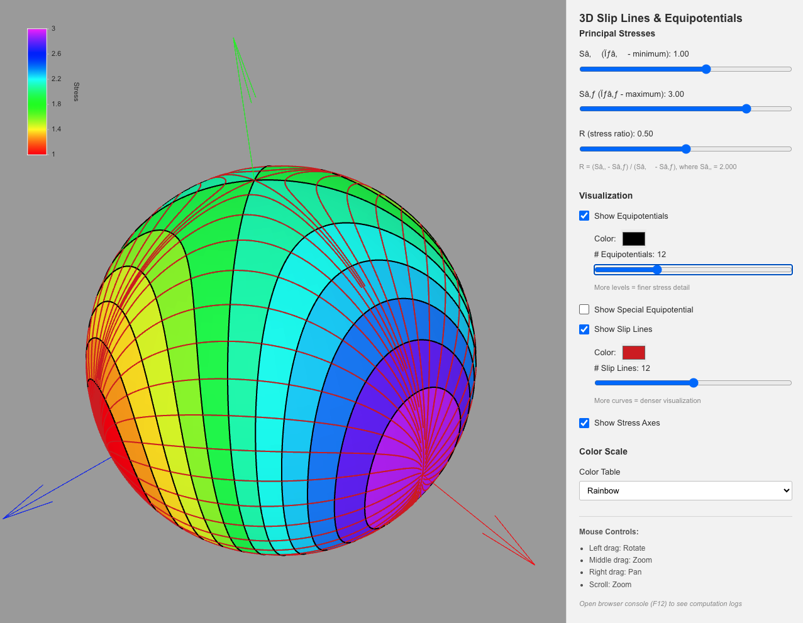

# 3D Slip Lines & Equipotentials Visualization

  

A modern React/TypeScript component using Three.js for visualizing theoretical slip lines, equipotential curves, and principal stress axes on a 3D sphere.

    <a href="https://alfredicus.github.io/slip-lines/"><b>Launch the app...</b></a>

## Features

- **3D Interactive Visualization**: Rotate, zoom, and inspect the stress field
- **Equipotential Curves**: Visualize equipotential surfaces from the stress tensor
- **Slip Lines**: Generate and display theoretical slip lines in 3D
- **Principal Stress Axes**: Show the three principal stress directions with colored arrows
- **Real-time Parameter Adjustment**: Dynamically adjust stress tensor components (σ_x, σ_y, σ_z)
- **Color Customization**: Change colors for slip lines and equipotentials
- **Responsive Design**: Works on different screen sizes with side panel controls

## References

- Taboada, A., 1993. **Stress and strain from striated pebbles. Theoretical analysis of striations on a rigid spherical body linked to a symmetrical tensor**. Journal of structural geology, 15(11), pp.1315-1330.
